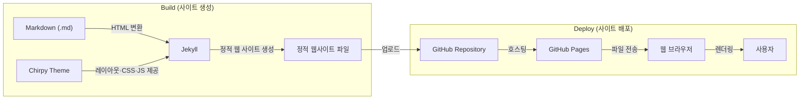

# Nosilv blog memo
블로그를 만들고 있는 **과거의 내가  
미래의 나를 구하기 위해** 작성하는 메모장

- 내 블로그 구조
- 내가 사용한 리눅스 문법 정리
- 내가 사용할 마크다운 문법 정리

## Table of Contents
- [Table of Contents](#table-of-contents)
- [2. How This Blog Is Built - Jekyll, Chirpy, GitHub](#2-how-this-blog-is-built---jekyll-chirpy-github)
- [3. Linux memo](#3-linux-memo)

## 2. How This Blog Is Built - Jekyll, Chirpy, GitHub

> - **Chirpy 테마**를 적용한
> - **정적 웹 사이트 생성기, Jekyll** 기반의
> - GitHub Pages 블로그
> 
> \* **정적 웹 사이트란?** 서버에 미리 업로드 되어있는 HTML, CSS, JavaScript 파일을 사용자의 요청에 따라 **그대로 전달**하는 웹사이트  
> ↔ **동적 웹 사이트**: 사용자의 요청이 있을 때마다 **서버가 페이지를 새로 생성**하는 웹사이트

 
|사용 요소|역할|비유|
|--|--|--|
|Markdown(.md)|사용자가 작성한 글의 언어|원고|
|Chirpy Theme|사이트 레이아웃(HTML), 스타일(CSS), 기능(JavaScript) 제공|책 디자인|
|Jekyll| 1. **Markdown(.md)** 로 작성된 글을 **HTML로 변환**   2. **테마와 여러 페이지를 결합**하여 하나의 정적 웹사이트 생성|원고와 디자인을 합쳐 책을 만드는 인쇄소|
|GitHub Repository|모든 소스 코드 및 파일 저장|서점 창고|
|GitHub Pages|저장된 웹사이트를 배포(호스팅)|서점 진열대|
|Web Browser|웹사이트 파일을 요청해서 방문하는 창|독자가 책을 읽는 공간|

**전체적 흐름**
1. 내가 글을 **Markdown** 으로 계속 작성하면
2. **Jekyll**은 내가 작성한 .md 글을 HTML로 변환
3. 그 다음, Jekyll은 모든 글과 `내가 설정한 사이트 테마`를 합쳐서 **정적 웹사이트 파일 세트**를 만듦  
\* 위 과정들에 필요하거나 만들어진 Markdown 파일, 테마, 설정 파일 등 프로젝트 전체는 GitHub Repository에 저장되어 있음
4. 어느 날, 누군가 인터넷 브라우저에 내 사이트 URL을 입력하면
5. 해당 웹 브라우저는 GitHub Pages에 나의 웹사이트 파일을 요청함
6. 상시대기하던 정적 사이트 전용 호스팅 서비스 **GitHub Pages**는 그 브라우저에게 내 사이트 파일을 전달
7. 브라우저는 전달받은 사이트 파일(HTML, CSS, JavaScript)를 해석하여 웹사이트를 화면에 렌더링 함
* 즉, **Jekyll은 블로그를 '만드는(Build)' 역할**을, **GitHub Pages는 만들어진 블로그를 '서비스하는(Deploy)' 역할**을 담당함

## 3. Linux memo
